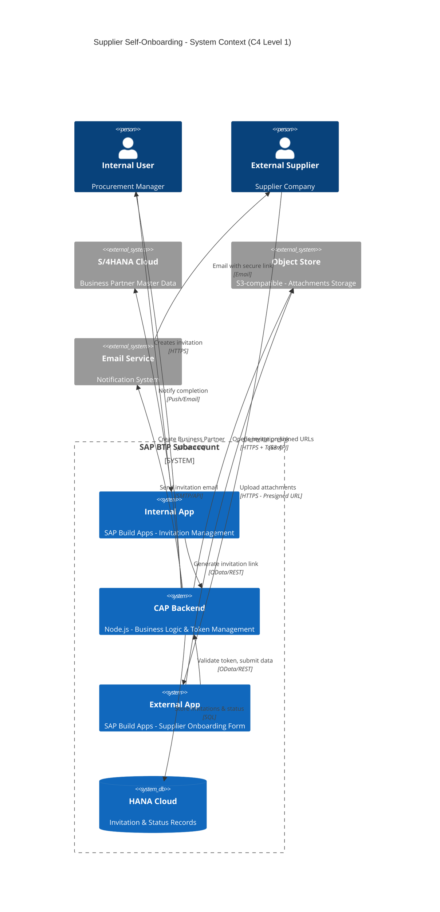
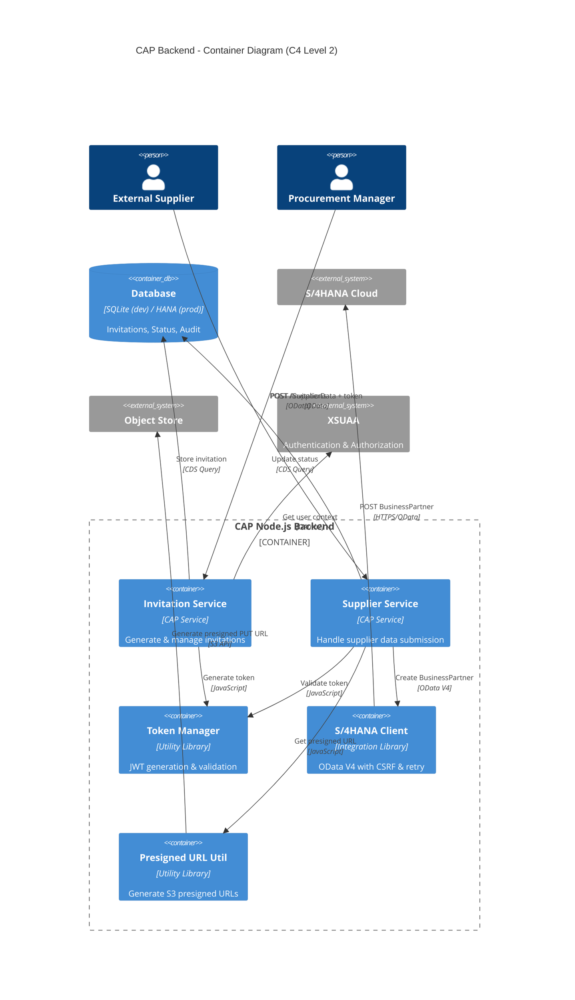

# Plan of Action: Supplier Self-Onboarding Solution

## Executive Summary

Build a **secure, production-grade supplier self-onboarding solution** with local development in SAP Business Application Studio (Dev Space Manager), following the client's 5-step user journey and deploying to their BTP infrastructure.

---

## High-Level Architecture





---

## Client Requirements Mapping

| Client Requirement | Implementation Approach |
|-------------------|------------------------|
| **Internal App to initiate process** | SAP Build Apps → CAP Invitation Service → Generate invitation + token |
| **Send email with link** | CAP backend → Email service integration (mock in dev, real in prod) |
| **Secure link creation** | JWT tokens (15min TTL, single-use, audience validation, no registration) |
| **External App for data entry** | SAP Build Apps → Token-authenticated access → Multi-page form |
| **Inform internal user** | CAP backend → Status updates → Email/push notification to manager |

---

## Development Phases

### Phase 1: Local Development (Dev Space Manager)
- **Environment**: SAP Business Application Studio
- **Database**: SQLite (in-memory or file-based)
- **Authentication**: Mocked (hardcoded user context)
- **External Services**: Mocked (S/4HANA, Object Store, Email)
- **Goal**: Fully functional CAP backend testable locally

### Phase 2: BTP Deployment
- **Database**: HANA Cloud
- **Authentication**: XSUAA with proper OAuth2 flows
- **Destinations**: Configure for S/4HANA, Object Store
- **Services**: Bind HANA, XSUAA, Destination services
- **Goal**: CAP backend running on BTP with real integrations

### Phase 3: Frontend Integration
- **Internal App**: SAP Build Apps (invitation management UI)
- **External App**: SAP Build Apps (supplier onboarding form)
- **Integration**: Connect to deployed CAP backend via OData
- **Goal**: End-to-end working solution

---

## Implementation Roadmap (24 Steps)

### **Foundation (Steps 1-4)**
1. Initialize CAP project structure with CDS models and services
2. Define domain model: Invitations, Suppliers, Attachments entities with proper aspects
3. Create Invitation Service with basic CRUD operations
4. Create Supplier Service with token-validated endpoints

### **Security & Token Management (Steps 5-8)**
5. Implement JWT token generation utility with configurable TTL and signing
6. Implement JWT token validation middleware with expiration and audience checks
7. Add single-use token enforcement (mark token as consumed after first use)
8. Test token lifecycle: generation, validation, expiration, tampering scenarios

### **S/4HANA Integration Mock (Steps 9-11)**
9. Create S/4HANA client mock for Business Partner creation (local testing)
10. Implement OData V4 request structure for BP creation with CSRF token handling
11. Test S/4HANA mock: success response, error handling, duplicate detection

### **Object Store Integration Mock (Steps 12-14)**
12. Create presigned URL generator mock for S3-compatible storage
13. Implement file upload workflow: request presigned URL → upload → confirm
14. Test presigned URL lifecycle: generation, expiration, upload simulation

### **Business Logic Implementation (Steps 15-18)**
15. Implement invitation creation: validate internal user, generate token, store record
16. Implement supplier data submission: validate token, parse payload, validate fields
17. Integrate S/4HANA client: submit Business Partner data on supplier submission
18. Integrate Object Store: generate presigned URLs for attachment uploads

### **Status Tracking & Notifications (Steps 19-21)**
19. Add invitation status tracking: PENDING, IN_PROGRESS, COMPLETED, EXPIRED
20. Implement status update logic on supplier submission and S/4HANA response
21. Create notification mock: email internal user on completion

### **Testing & Validation (Steps 22-24)**
22. Write comprehensive unit tests for token manager and validators
23. Write integration tests for end-to-end invitation → submission → S/4 → notification flow
24. Perform security testing: expired tokens, tampered tokens, unauthorized access

---

## Technical Stack

### Backend (CAP Node.js)
- **Framework**: @sap/cds ^7
- **Runtime**: Node.js (LTS)
- **Database**: SQLite (dev) → HANA Cloud (prod)
- **Authentication**: Mock (dev) → XSUAA (prod)
- **Libraries**: 
  - `jsonwebtoken` for JWT handling
  - `crypto` for secure token generation
  - Custom utilities for S/4HANA & Object Store

### Frontend (SAP Build Apps)
- **Internal App**: Invitation management, status dashboard
- **External App**: Multi-page supplier onboarding form
- **Design**: Fiori Horizon theme, responsive layouts
- **Integration**: OData bindings to CAP services

### External Integrations
- **S/4HANA Cloud**: Business Partner OData V4 API
- **Object Store**: S3-compatible API (presigned URLs)
- **Email Service**: SMTP/API (to be determined)

---

## Security Architecture

### Token-Based Authentication
```
┌─────────────────────────────────────────────────────────────┐
│ Invitation Generation (Internal User)                       │
│ ─────────────────────────────────────────────────────────── │
│ 1. Manager creates invitation via Internal App              │
│ 2. CAP backend generates JWT with:                          │
│    - Supplier email (sub)                                   │
│    - Expiration (15 minutes)                                │
│    - Audience: supplier-onboarding                          │
│    - Single-use flag                                        │
│ 3. Token embedded in URL: /onboard?token=<JWT>              │
│ 4. Email sent to supplier with link                         │
└─────────────────────────────────────────────────────────────┘

┌─────────────────────────────────────────────────────────────┐
│ Token Validation (External Supplier)                        │
│ ─────────────────────────────────────────────────────────── │
│ 1. Supplier clicks link, opens External App                 │
│ 2. App extracts token from URL                              │
│ 3. App sends token with every API request                   │
│ 4. CAP backend validates:                                   │
│    ✓ Signature valid                                        │
│    ✓ Not expired                                            │
│    ✓ Audience matches                                       │
│    ✓ Not already used (check DB)                            │
│ 5. On first valid use: mark token as consumed               │
│ 6. On subsequent use: reject (already consumed)             │
└─────────────────────────────────────────────────────────────┘
```

### Data Flow Security
- **No credentials on client**: Tokens are short-lived, single-use
- **Least privilege**: Token only grants access to supplier's own data
- **Presigned URLs**: Direct upload to Object Store, no backend proxy
- **Audit trail**: All actions logged with timestamps and user context

---

## Testing Strategy

### Unit Tests
- Token generation/validation logic
- Data validators (email, tax ID, etc.)
- Mock service responses

### Integration Tests
- End-to-end invitation flow
- Supplier submission with S/4HANA mock
- File upload with presigned URL mock
- Status updates and notifications

### Security Tests
- Expired token rejection
- Tampered token rejection
- Token reuse prevention
- Unauthorized access attempts

### Manual Tests (Dev Space Manager)
- `cds watch` → Test with REST client or Postman
- Verify SQLite database records
- Check console logs for errors
- Test edge cases (missing fields, invalid data)

---

## Success Criteria

### Phase 1 (Local Development) ✅
- [ ] CAP backend runs with `cds watch` in Dev Space Manager
- [ ] Invitation creation API works (returns token)
- [ ] Token validation works (accepts valid, rejects expired/tampered)
- [ ] Supplier submission API works (validates token, stores data)
- [ ] S/4HANA mock called successfully
- [ ] Presigned URL mock generates valid URLs
- [ ] Status tracking updates correctly
- [ ] All tests pass (unit + integration)

### Phase 2 (BTP Deployment) ✅
- [ ] CAP backend deployed to BTP (cf push)
- [ ] HANA Cloud connected and accessible
- [ ] XSUAA authentication working
- [ ] Destination service configured for S/4HANA
- [ ] Real S/4HANA integration tested
- [ ] Real Object Store integration tested

### Phase 3 (Frontend Integration) ✅
- [ ] Internal App connects to CAP backend
- [ ] External App opens with token authentication
- [ ] Supplier can fill form and upload attachments
- [ ] Manager receives completion notification
- [ ] End-to-end flow works in production

---

## Risk Mitigation

| Risk | Mitigation |
|------|-----------|
| **S/4HANA API changes** | Use only released, stable APIs; version-pin OData endpoints |
| **Token security breach** | Short TTL (15min), single-use enforcement, audience validation |
| **File upload failures** | Retry logic, presigned URL expiration handling, size limits |
| **Performance bottlenecks** | Database indexing, async processing, CAP generic providers |
| **Deployment complexity** | Test thoroughly in Dev Space first, use MTA descriptor for deployment |

---

## Next Steps

1. **Review & Approve**: Client reviews this Plan of Action
2. **Start Step 1**: Initialize CAP project in Dev Space Manager
3. **Iterative Development**: Complete steps 1-24 with user confirmation at each step
4. **Deploy to BTP**: Once local testing is complete
5. **Build Frontend**: SAP Build Apps integration
6. **Go Live**: Production rollout with client

---

## Timeline Estimate (Development Only)

- **Phase 1 (Local)**: 2-3 weeks (Steps 1-24)
- **Phase 2 (BTP Deployment)**: 1 week (configuration & testing)
- **Phase 3 (Frontend)**: 2 weeks (SAP Build Apps development)

**Total**: ~5-6 weeks for full implementation

---

**Document Version**: 1.0  
**Last Updated**: February 4, 2026  
**Status**: Awaiting client approval to proceed with Step 1
