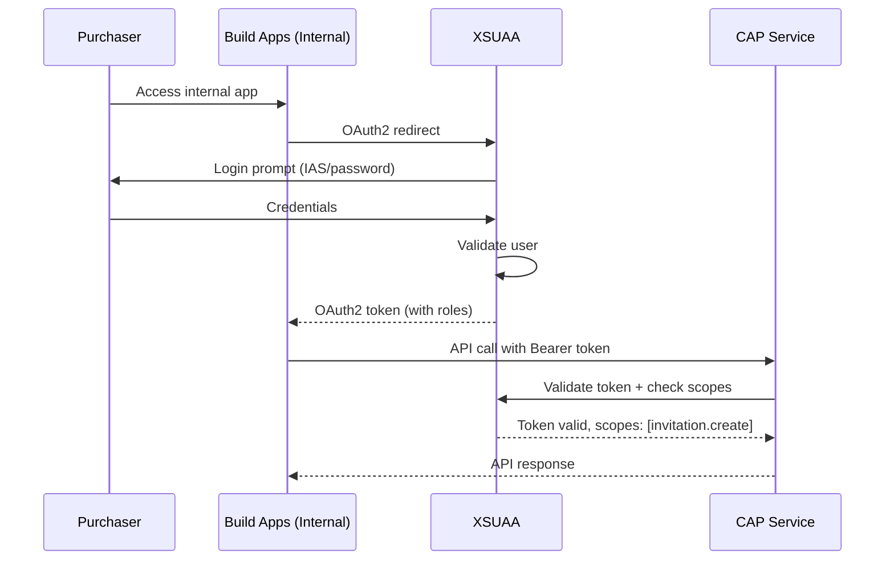
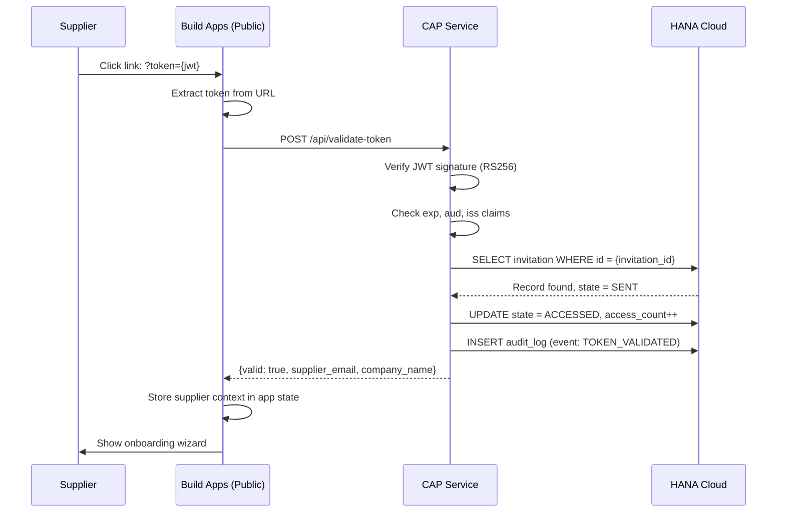

# Security Architecture & Token Lifecycle

**Project**: Supplier Self-Onboarding Solution  
**Version**: 1.0  
**Last Updated**: 2026-02-03

---

## 1. JWT Token Schema

### Token Structure

```json
{
  "header": {
    "alg": "RS256",
    "typ": "JWT",
    "kid": "xsuaa-key-id"
  },
  "payload": {
    "iss": "supplier-onboarding-cap",
    "sub": "invitation-service",
    "aud": "supplier-onboarding-app",
    "exp": 1739052000,
    "iat": 1738447200,
    "jti": "550e8400-e29b-41d4-a716-446655440000",
    "scope": ["supplier.onboard"],
    "zid": "uaa-tenant-id",
    "custom_claims": {
      "invitation_id": "550e8400-e29b-41d4-a716-446655440000",
      "supplier_email": "contact@supplier-company.com",
      "company_name": "Acme Supplier GmbH",
      "requester_id": "purchaser.user@company.com",
      "requester_name": "John Smith",
      "created_at": "2026-02-03T10:00:00Z",
      "purpose": "supplier_onboarding",
      "allowed_uses": 1,
      "initial_state": "CREATED"
    }
  },
  "signature": "..."
}
```

### Token Claims Explained

| Claim | Type | Description | Required |
|-------|------|-------------|----------|
| `iss` | string | Issuer (CAP service identifier) | ✓ |
| `sub` | string | Subject (invitation-service) | ✓ |
| `aud` | string | Audience (supplier-onboarding-app) | ✓ |
| `exp` | number | Expiration timestamp (7 days from creation) | ✓ |
| `iat` | number | Issued at timestamp | ✓ |
| `jti` | string | Unique token ID (UUID v4) | ✓ |
| `scope` | array | OAuth2 scopes | ✓ |
| `invitation_id` | string | Database invitation record ID | ✓ |
| `supplier_email` | string | Supplier contact email | ✓ |
| `company_name` | string | Supplier company name | ✓ |
| `requester_id` | string | Internal user who created invitation | ✓ |
| `allowed_uses` | number | Max validation attempts (1 = single-use) | ✓ |

---

## 2. Token Lifecycle States

```
┌─────────┐
│ CREATED │ ──────► Token generated, stored in DB
└────┬────┘
     │
     ▼
┌─────────┐
│  SENT   │ ──────► Link delivered to supplier (manual)
└────┬────┘
     │
     ▼
┌──────────┐
│ ACCESSED │ ──────► Supplier clicked link, token validated
└────┬─────┘
     │
     ▼
┌──────────────┐
│ IN_PROGRESS  │ ──────► Supplier filling form (draft saves)
└────┬─────────┘
     │
     ▼
┌───────────┐
│ SUBMITTED │ ──────► Form submitted, processing started
└────┬──────┘
     │
     ▼
┌──────────┐
│ CONSUMED │ ──────► Successfully processed (final state)
└──────────┘

Alternative end states:
├─► EXPIRED  (exp timestamp exceeded)
├─► REVOKED  (admin cancellation)
└─► FAILED   (S/4HANA error, rollback occurred)
```

### State Transition Rules

| From State | To State | Trigger | Validations |
|------------|----------|---------|-------------|
| CREATED | SENT | Admin marks as sent | - |
| CREATED | REVOKED | Admin revokes | - |
| SENT | ACCESSED | Supplier opens link | Token signature valid, not expired |
| ACCESSED | IN_PROGRESS | First form interaction | - |
| IN_PROGRESS | IN_PROGRESS | Draft save | Token still valid |
| IN_PROGRESS | SUBMITTED | Final submit | All validations pass |
| SUBMITTED | CONSUMED | S/4HANA success | BP created, files uploaded |
| SUBMITTED | FAILED | S/4HANA error | Error logged, can retry |
| * | EXPIRED | Time passes | Current time > exp |
| SENT/ACCESSED/IN_PROGRESS | REVOKED | Admin action | Admin has manage scope |

---

## 3. Authentication Flows

### 3.1 Internal User Authentication (Purchaser)



**Security Controls**:
- OAuth2 Authorization Code Flow
- XSUAA role-based access control
- Token expiry: 12 hours (XSUAA default)
- Refresh token rotation

### 3.2 External Supplier Authentication (Magic Link)



**Security Controls**:
- Stateless JWT validation (no session required)
- Database-backed revocation check
- Rate limiting (max 5 validation attempts per token)
- Single-use enforcement (state machine prevents replay)
- IP address logging (anomaly detection)

---

## 4. XSUAA Configuration

### 4.1 Scopes

```json
{
  "scopes": [
    {
      "name": "$XSAPPNAME.supplier.onboard",
      "description": "External supplier can submit onboarding form",
      "grant-as-authority-to-apps": []
    },
    {
      "name": "$XSAPPNAME.invitation.create",
      "description": "Create supplier invitation links",
      "grant-as-authority-to-apps": []
    },
    {
      "name": "$XSAPPNAME.invitation.manage",
      "description": "View, revoke, and manage all invitations",
      "grant-as-authority-to-apps": []
    },
    {
      "name": "$XSAPPNAME.invitation.audit",
      "description": "Read-only access to audit logs",
      "grant-as-authority-to-apps": []
    }
  ]
}
```

### 4.2 Role Templates

```json
{
  "role-templates": [
    {
      "name": "SupplierOnboardingPurchaser",
      "description": "Purchaser can create invitations",
      "scope-references": [
        "$XSAPPNAME.invitation.create"
      ],
      "attribute-references": []
    },
    {
      "name": "SupplierOnboardingAdmin",
      "description": "Admin can create and manage all invitations",
      "scope-references": [
        "$XSAPPNAME.invitation.create",
        "$XSAPPNAME.invitation.manage",
        "$XSAPPNAME.invitation.audit"
      ],
      "attribute-references": []
    },
    {
      "name": "SupplierOnboardingAuditor",
      "description": "Read-only auditor access",
      "scope-references": [
        "$XSAPPNAME.invitation.audit"
      ],
      "attribute-references": []
    }
  ]
}
```

### 4.3 Role Collections (BTP Cockpit)

| Role Collection | Role Template | Users |
|-----------------|---------------|-------|
| `supplier-onboarding-purchaser-rc` | SupplierOnboardingPurchaser | Purchasing team members |
| `supplier-onboarding-admin-rc` | SupplierOnboardingAdmin | IT admins, super users |
| `supplier-onboarding-auditor-rc` | SupplierOnboardingAuditor | Compliance, security team |

---

## 5. Security Controls & Threat Mitigation

### 5.1 Token Security

| Threat | Mitigation | Implementation |
|--------|------------|----------------|
| Token interception | HTTPS only, HSTS headers | Enforced in CAP service, Build Apps |
| Token replay | Single-use + state machine | DB check on each validation |
| Token forgery | RS256 signature | Verify against XSUAA public key |
| Brute force | Rate limiting | Max 5 attempts per token per hour |
| Long-lived tokens | Short expiry | 7 days (configurable) |

### 5.2 Data Protection

| Layer | Protection | Standard |
|-------|------------|----------|
| In Transit | TLS 1.2+ | All HTTPS endpoints |
| At Rest (DB) | HANA encryption | AES-256 |
| At Rest (Files) | S3 SSE | SSE-S3 or SSE-KMS |
| PII Handling | Data minimization | Only required fields stored |

### 5.3 Access Control

**Principle of Least Privilege**:
- External supplier: No BTP account, token-based access only
- Purchaser: Can create invitations, view own invitations
- Admin: Can manage all invitations, view audit logs
- Auditor: Read-only access to logs

**Authorization Checks**:
```javascript
// Pseudocode for CAP service authorization
@restrict: [
  { grant: 'CREATE', to: 'invitation.create' },
  { grant: 'READ', to: 'invitation.create', where: 'createdBy = $user' },
  { grant: ['READ', 'UPDATE', 'DELETE'], to: 'invitation.manage' }
]
entity SupplierInvitations { ... }
```

---

## 6. Rate Limiting Rules

| Scope | Limit | Window | Action on Exceed |
|-------|-------|--------|------------------|
| Per Token | 5 validations | 1 hour | Return 429, log security event |
| Per IP (validation endpoint) | 20 requests | 1 hour | Temporary block, alert admin |
| Per User (create invitation) | 10 invitations | 1 hour | Reject with error message |
| Global API | 1000 requests | 1 minute | Apply backpressure, throttle |

**Implementation**: Express middleware `express-rate-limit` + Redis (optional) or in-memory store.

---

## 7. Audit Logging

### Events to Log

| Event | Log Level | Fields |
|-------|-----------|--------|
| Invitation created | INFO | user_id, invitation_id, supplier_email |
| Token validated (success) | INFO | invitation_id, ip_address, user_agent |
| Token validation failed | WARNING | reason, ip_address, attempted_token_id |
| Rate limit exceeded | WARNING | ip_address, endpoint |
| Invitation revoked | INFO | admin_id, invitation_id, reason |
| Form submitted | INFO | invitation_id, bp_id, attachment_count |
| S/4HANA error | ERROR | invitation_id, error_code, error_message |
| Unauthorized access attempt | SECURITY | user_id, endpoint, attempted_scope |

### Audit Log Schema

```cds
entity AuditLog {
  key log_id       : UUID;
  timestamp        : Timestamp;
  event_type       : String(50);
  severity         : String(10); // INFO, WARNING, ERROR, SECURITY
  user_id          : String(100);
  invitation_id    : UUID;
  ip_address       : String(45);
  user_agent       : String(500);
  event_details    : String(2000); // JSON serialized
  session_id       : String(100);
}
```

---

## 8. Compliance & Data Retention

### GDPR Compliance

- **Right to Access**: Supplier can request their data via support email
- **Right to Erasure**: Data deleted 90 days post-submission (configurable)
- **Data Minimization**: Only collect required fields
- **Consent**: Implicit consent via form submission (documented in T&C)

### Retention Policies

| Data Type | Retention | Reason |
|-----------|-----------|--------|
| Invitation records (success) | 90 days | Operational need |
| Invitation records (expired) | 30 days | Cleanup expired links |
| Audit logs | 7 years | Regulatory compliance |
| Uploaded documents | Supplier lifecycle | Business requirement (S/4HANA) |
| Temp supplier data (drafts) | 30 days | Allow form recovery |

---

## 9. Monitoring & Alerts

### Alert Triggers

1. **Failed validations > 3** from same IP within 5 minutes → Potential attack
2. **Multiple IPs** accessing same token within 10 minutes → Token sharing
3. **Expired token access** attempts → User confusion or replay attempt
4. **S/4HANA API errors** → Integration issue
5. **Object Store upload failures** → Storage quota or connectivity issue

### Monitoring Metrics

- Token validation success rate
- Average time from CREATED to CONSUMED
- S/4HANA API response times
- Object Store upload success rate
- Active invitations by state

---

## 10. Testing & Verification

### Security Test Cases

✅ **Token Validation**:
- Valid token → Accept
- Expired token → Reject (401)
- Invalid signature → Reject (401)
- Revoked token → Reject (403)
- Consumed token → Reject (410 Gone)

✅ **Authorization**:
- Purchaser creates invitation → Allow
- Auditor creates invitation → Deny (403)
- Purchaser views own invitations → Allow
- Purchaser views others' invitations → Deny (403)
- Admin views all invitations → Allow

✅ **Rate Limiting**:
- 5 token validations in 1 hour → Allow
- 6th validation → Reject (429)
- After 1 hour → Allow again

✅ **Audit Logging**:
- All events logged with correct severity
- PII not logged in plain text
- Logs queryable by admin

---

**Document Status**: ✅ Complete  
**Next Step**: Implement this architecture in Step 2 (CAP project initialization)
