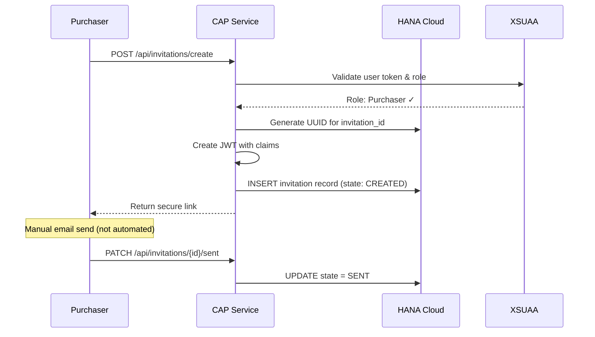
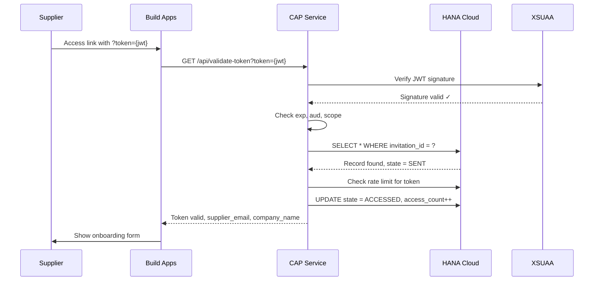

# Security Architecture & Token Lifecycle

## Token Schema (JWT)

### Invitation Token Structure
```json
{
  "header": {
    "alg": "RS256",
    "typ": "JWT",
    "kid": "xsuaa-key-id"
  },
  "payload": {
    "iss": "https://<tenant>.authentication.<region>.hana.ondemand.com",
    "sub": "invitation-service",
    "aud": "supplier-onboarding-app",
    "exp": 1234567890,
    "iat": 1234560000,
    "jti": "unique-token-id",
    "scope": ["supplier.onboard"],
    "custom_claims": {
      "invitation_id": "uuid-v4",
      "supplier_email": "supplier@example.com",
      "requester_id": "purchaser-user-id",
      "company_name": "Acme Corp",
      "purpose": "supplier_onboarding",
      "allowed_uses": 1,
      "state": "pending"
    }
  }
}
```

## Token Lifecycle States

1. **CREATED** → Token generated by internal user
2. **SENT** → Token delivered via email
3. **ACCESSED** → Supplier clicked link (first access)
4. **IN_PROGRESS** → Form data being entered
5. **SUBMITTED** → Form completed and submitted
6. **EXPIRED** → Token TTL exceeded
7. **REVOKED** → Manually cancelled by admin
8. **CONSUMED** → Successfully processed (final state)

## Security Controls

### Authentication Layers
- **Internal Users**: XSUAA OAuth 2.0 + Role-based access
- **External Suppliers**: JWT token validation (stateless)
- **S/4HANA Integration**: X.509 certificate or OAuth 2.0 client credentials
- **Object Store**: Presigned URLs with expiry

### Token Security Parameters
- **Algorithm**: RS256 (RSA + SHA-256)
- **Expiry**: 7 days (configurable via JWT_EXPIRY env var)
- **Single-use**: Token invalidated after submission
- **Rate Limiting**: Max 5 validation attempts per token per hour
- **IP Binding** (optional): Record first access IP for anomaly detection

### Data Protection
- **In Transit**: TLS 1.2+ for all communications
- **At Rest**: Encrypted Object Store (S3 SSE-S3 or SSE-KMS)
- **PII Handling**: GDPR-compliant data retention (90 days for invitation records)
- **Audit Trail**: All token operations logged to HANA Cloud audit table

## Token Generation Flow



## Token Validation Flow



## Revocation Strategy

Since JWT is stateless, implement database-backed revocation:
- Maintain `invitation_tokens` table with status column
- Check database on each token validation request
- Background job to clean up expired tokens (runs daily at 2 AM UTC)
- Admin can manually revoke via PATCH /api/invitations/{id}/revoke

## Key Rotation

- XSUAA handles key rotation automatically
- Token validation uses `kid` header to fetch correct public key from XSUAA JWKS endpoint
- Old tokens remain valid until expiry even after key rotation
- Recommended XSUAA key rotation: every 90 days (BTP default)

## Rate Limiting Rules

| Scope | Limit | Window | Action on Exceed |
|-------|-------|--------|------------------|
| Per Token | 5 validations | 1 hour | Return 429, log security event |
| Per IP Address | 20 validations | 1 hour | Temporary block, alert admin |
| Per Email | 3 active invitations | N/A | Reject new invitation creation |
| Global API | 1000 requests | 1 minute | Throttle, enable backpressure |

## Monitoring & Security Alerts

### Alert Triggers
1. Failed validation attempts > 3 from same IP
2. Expired token access attempts (potential replay attack)
3. Multiple IPs accessing same token within 5 minutes
4. Unusual submission patterns (bulk creates, SQL injection attempts)
5. Token state transitions skipping steps (e.g., CREATED → SUBMITTED)

### Log Events (to HANA audit table)
```javascript
{
  timestamp: "2026-02-03T10:15:30Z",
  event_type: "TOKEN_VALIDATION",
  invitation_id: "uuid",
  result: "SUCCESS|FAILURE",
  ip_address: "203.0.113.45",
  user_agent: "Mozilla/5.0...",
  error_code: null,
  metadata: {
    state_before: "SENT",
    state_after: "ACCESSED"
  }
}
```

## XSUAA Scopes & Roles

### Scopes
- `supplier.onboard` → External supplier can submit onboarding form
- `invitation.create` → Internal user can generate invitation links
- `invitation.manage` → Admin can view/revoke all invitations
- `invitation.audit` → Read-only access to audit logs

### Role Templates
- **SupplierOnboardingPurchaser** → Contains: invitation.create
- **SupplierOnboardingAdmin** → Contains: invitation.create, invitation.manage, invitation.audit
- **SupplierOnboardingAuditor** → Contains: invitation.audit

### Role Collections (BTP Cockpit)
- `supplier-onboarding-purchaser-rc`
- `supplier-onboarding-admin-rc`
- `supplier-onboarding-auditor-rc`

## Threat Model & Mitigations

| Threat | Mitigation |
|--------|-----------|
| Token interception | HTTPS only, HSTS headers, short expiry |
| Token replay | Single-use enforcement via state machine |
| Brute force | Rate limiting, CAPTCHA after 3 failures |
| Email spoofing | DKIM/SPF verification (email sender) |
| SQL injection | Parameterized queries, input validation |
| XSS | Content Security Policy, input sanitization |
| CSRF | SameSite cookies, double-submit tokens |
| Privilege escalation | Principle of least privilege, XSUAA roles |
| Data exfiltration | Object Store presigned URLs with 15-min expiry |

## Compliance & Data Retention

- **GDPR**: Supplier can request data deletion after 90 days
- **Audit Logs**: Retained for 7 years (regulatory requirement)
- **Invitation Records**: Auto-delete after 90 days post-submission
- **Uploaded Documents**: Retained per supplier master data lifecycle

## Environment Variables (Security Config)

```bash
# JWT Configuration
JWT_ISSUER=https://<tenant>.authentication.<region>.hana.ondemand.com
JWT_AUDIENCE=supplier-onboarding-app
JWT_EXPIRY=7d
JWT_ALGORITHM=RS256

# Rate Limiting
RATE_LIMIT_TOKEN_MAX=5
RATE_LIMIT_TOKEN_WINDOW=3600000
RATE_LIMIT_IP_MAX=20
RATE_LIMIT_IP_WINDOW=3600000

# Security Headers
ENABLE_HSTS=true
ENABLE_CSP=true
ALLOWED_ORIGINS=https://build-apps.cloud.sap,https://workzone.example.com

# Audit & Monitoring
ENABLE_AUDIT_LOG=true
AUDIT_LOG_RETENTION_DAYS=2555
LOG_LEVEL=info
ALERT_EMAIL=security-team@example.com
```

---

**Document Version**: 1.0  
**Last Updated**: 2026-02-03  
**Owner**: SAP BTP Architecture Team
